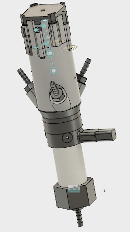

The moineau pump is a controlled method of pumping slurries. While this method does not provide efficient mixin, it does pump at a constant rate (for a given speed) regardless of viscosity.

Moineau pumps are comprised primarily of a rotor and a stator. The rotor is (usually) driven eccentrically while the stator is held in place.

In addition to the rotor and stator, this design includes:
* manifold - house the gears and provide inlets for the slurries to enter and mix
* planetary gear set - eccentrically drive the rotor
* motor - drives the gears
* nozzle - shapes the extrusion
